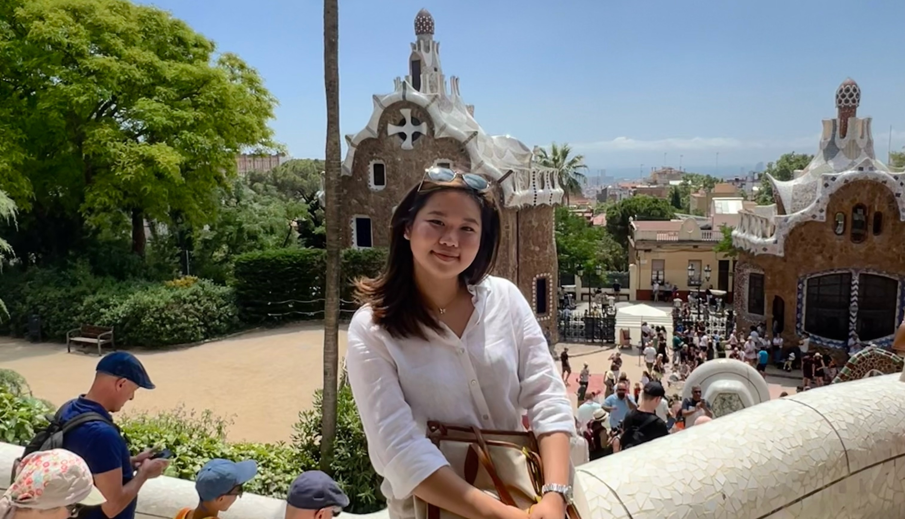

{width=500px}

Welcome to my website! I'm Ru Jin, currently a first year MS Biostatistics student at Columbia University Mailman School of Public Health. 

## My background

Before this, I completed my BSc in Statistics in University College London. Feeling disenchanted with the career progression towards finance halfway through my degree and with the COVID-19 outbreak raging, I was inspired to learn about health data science and biostatistics by taking several classes related to statistics in healthcare. To deepen my understanding of drug development and clinical trials, I attended the [Statisticians in the Pharmaceutical Industry (PSI) Conference](https://www.psiweb.org/conferences/about-the-conference) in Gothenburg last summer. By also attending the [6th Malaysian Telemedicine Conference](https://www.digitalhealthmalaysia.org/dhm2022/home), I gained further insight into the digital health scene and saw how harnessing data can revolutionize healthcare. All these experiences have inspired me to pursue a career in public health and strengthened my belief in the power of health data science.

## My past work

During college, the project that sparked my interest was one involving the understanding of COVID-19. I first carried out an exploratory analysis to understand the demographic and socio-economic factors in various parts of the UK, then estimated the number of deaths through building a statistical model. Additionally, my dissertation involved implementing existing growth-fragmentation approaches to better understand the behavior of cell distributions over time. I also completed a simulation project where I tested 4 methods of boarding and deboarding passengers for a flight and compared their efficiency in reducing turnaround time. Upon completion, I quickly identified the common theme behind these projects that I greatly enjoyed – the blend of statistics, research, and computing, especially in the context of health science and medicine. This satisfaction was mainly supported by my strong foundation in statistics, calculus, and linear algebra, as well as my ability to code in R, Python, Stata, BUGS and SAS. Feel free to know more about the academic projects that I have been involved in [here](projects.html), and my past experiences that led me to where I am now [here](work.html).

Outside of work, cooking and crocheting are my main stress relievers. Read more about my hobbies [here](fun.html)!
